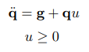
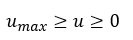
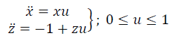
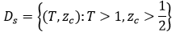
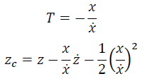
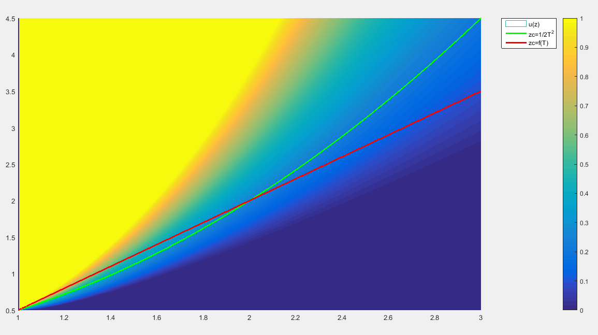
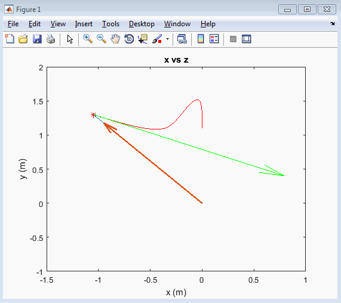
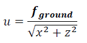

# vhip-humanoids-push-recovery-control
Bachellor Thesis - Stabilization of the Variable-Height Inverted Pendulum based on Input-State Stability and Sliding Mode Control under Unilateral Contact and Input Saturation.

Abstract:

Mantain the balance when a robot is pushed forward is fundamental for legged robots. An essential topic in the literature is capture point, it is the place where the robot must put its legs to keep the balance. In this work, we study the variable-height inverted pendulum as a model for a pushed robot. We found all the points and the possible places which are allowed to be a capture point for given initial velocities of the center of mass and actuator limitations. We also develop a controller to reach that capture point using the reaction force to the ground as input variable. We pay attention to the unilateral contact and the maximum-value saturation reaction force. We first obtain the necessary conditions that must be satisfied to be able to achieve balance. Then we present a control law to stabilize the system and we show that the region of attraction is equivalent to the region of the necessary condition for balance. Finally we briefly discuss the physic places where balance can be achieved.

So we take the model of the paper from Koolen et. al. we based on:

They find the physical region were balance is possible and build a control law to stabilice the system in that whole region. In this work we impose an additional restriction:

We perform a change of coordinates (bijective) in the system to normalize it:

We find the physical region were balance is possible under the new conditions and build a control law to stabilice the system in that whole region. This region is the normalized system: 

Where the variables *T* and *zc<\sub>*, were defined in the original paper:

The control law was obtained using a sliding function, driving the system "continuosly" sliding mode control (without switching conditions) and saturating the system. In fact, control was performed on a reduced system of 2 variables from the original 4, proving with ISS theory that when the subsytem of 2 variables is stable, the whole system of 4 is also stable. The control law is showed as plot of the 2 variables:

We perform an example of the control with some initial conditions.

Finally, let's note that saturating *u* is not exactly the same as saturating the reaction force in the ground, in fact, is related in a little equation, exactly: 

Based on "Balance control using center of mass height variation: Limitations imposed by unilateral contact" - Koolen et. al. https://ieeexplore.ieee.org/document/7803247

*Note: Research is in Spanish, this is compulsory in my university for Thesis defense. 
